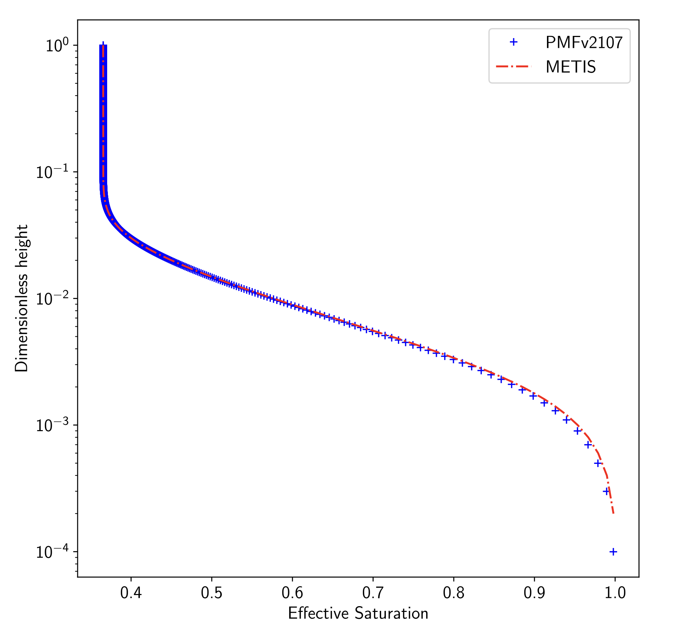
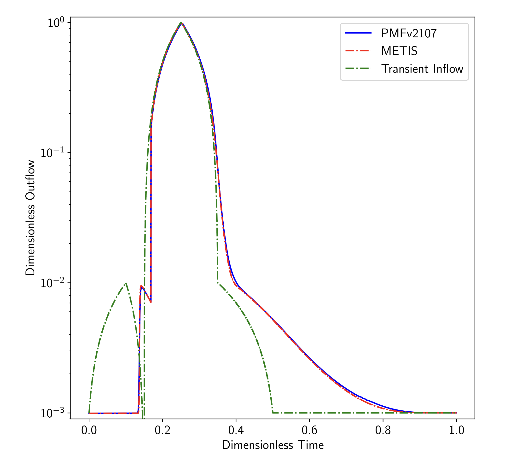

.. _groundwaterFoam-tutorials:

groundwaterFoam tutorials
=========================

The examples provided in the directory ``tutorials/groundwaterFoam-tutorials/`` illustrate the usage of the **groundwaterFoam** solver.

Validation Case 1: Steady Flow
------------------------------

The steady flow case tests the performance of the solver in a vertical 1D column with a height of :math:`H = 34.5 \, \text{m}` and discretized into 5009 cells. The simulation is driven by a constant infiltration velocity of :math:`V_{\text{top}} = 4.753 \times 10^{-9} \, \text{m/s}` at the top boundary, while the bottom boundary represents the saturated zone with a Dirichlet condition set to :math:`H_{\text{bottom}} = 0 \, \text{m}`.

This case employs the **Van Genuchten** model for water retention, with the following parameters:

- Porosity: :math:`\epsilon = 0.27`
- Permeability: :math:`K = 7 \times 10^{-12} \, \text{m}^2`
- Specific storage: :math:`S_s = 0.001`
- Van Genuchten parameters: :math:`\alpha = 13 \, \text{m}^{-1}`, :math:`m = 0.3007`

The system reaches steady-state after continuous infiltration. Numerical results from the **groundwaterFoam** solver are compared against the reference solution obtained from the **METIS** code (we take the METIS code solution as our reference solution because of its strong credibility and longevity). The comparison of the saturation distribution along the column shows excellent agreement, with only minor discrepancies near the bottom due to strong pressure head gradients.

Parameters:

- **Flow properties**

.. list-table::
   :header-rows: 1
   :align: center

   * - **Property**
     - **Symbol**
     - **Value**
     - **Unit**
   * - Viscosity
     - :math:`\mu`
     - :math:`1 \times 10^{-3}`
     - :math:`\text{Pa.s}`
   * - Density
     - :math:`\rho`
     - 100
     - :math:`\text{kg/m}^3`
   * - Van Genuchten coefficient
     - :math:`m`
     - 0.3007
     - [-]
   * - Van Genuchten coefficient
     - :math:`\alpha`
     - 13.0
     - :math:`\text{m}^{-1}`
   * - Permeability
     - :math:`K`
     - :math:`7 \times 10^{-12}`
     - :math:`\text{m}^2`
   * - Kinematic porosity
     - :math:`\epsilon`
     - 0.27
     - [-]
   * - Specific storage
     - :math:`S_s`
     - 0.001
     - [-]

- **Transport properties**

.. list-table::
   :header-rows: 1
   :align: center

   * - **Property**
     - **Symbol**
     - **Value**
     - **Unit**
   * - Total porosity
     - :math:`\epsilon_{\text{total}}`
     - 0.30
     - [-]
   * - Tortuosity
     - :math:`\tau`
     - 1
     - [-]
   * - Molecular diffusivity
     - :math:`D_m`
     - :math:`1 \times 10^{-9}`
     - :math:`\text{m}^2/\text{s}`
   * - Dispersivity coefficient
     - :math:`\alpha_L`
     - 1.0
     - :math:`\text{m}`
   * - --
     - :math:`\alpha_T`
     - 0.2
     - :math:`\text{m}`
   * - Volume partitioning coefficient
     - :math:`K_d`
     - :math:`5 \times 10^{-5}`
     - :math:`\text{m}^3/\text{kg}`
   * - Radioactive decay coefficient
     - :math:`\lambda`
     - :math:`1 \times 10^{-9}`
     - :math:`\text{s}^{-1}`

Visual results for the steady-state saturation profile:

- **Saturation profile for the steady flow case:**

Validation Case 2: Transient Flow
---------------------------------

The transient flow case starts from the steady-state solution obtained in the previous case. The infiltration velocity at the top boundary is varied over time using a piecewise linear function ranging from 0 to 1000 times the reference velocity (:math:`V_{\text{top}} = 4.753 \times 10^{-9} \, \text{m/s}`) over a period of 2315 days (∼2.108 seconds). 

This test aims to assess the solver's robustness under large variations in infiltration, particularly in the unsaturated zone. The results are presented in terms of the water flow rate at the bottom boundary, where a comparison is made between the results from **groundwaterFoam** and **METIS**. The two models show good agreement, with minor differences observed during the drainage phase due to discretization methods.

Parameters:

.. list-table::
   :header-rows: 0
   :align: center

   * - **Parameter**
     - **Value**
   * - Infiltration velocity :math:`V_{\text{top}}`
     - Variable (0 to 1000 times the reference velocity)
   * - Time duration
     - 2315 days
   * - Porosity :math:`\epsilon`
     - 0.27
   * - Permeability :math:`K`
     - :math:`7 \times 10^{-12} \, \text{m}^2`

The comparison of water flow rates:

- **Water flow rate comparison for the transient flow case:**

