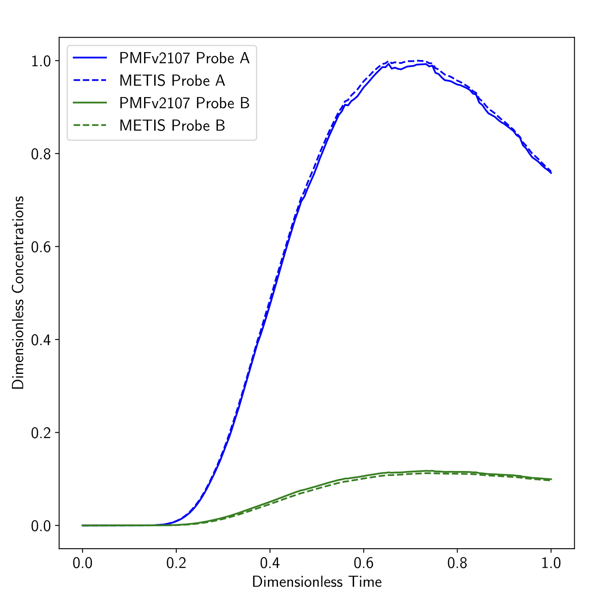

.. _groundwaterTransport2DFoam-tutorials:

groundwaterTransport2DFoam tutorials
====================================

The examples provided in the directory ``tutorials/groundwaterTransport2DFoam-tutorials/`` illustrate the usage of the **groundwaterTransport2DFoam** solver.

Validation Case: Coupled Water and Solute Transport in a 2D Watershed
---------------------------------------------------------------------

Starting from the steady-state simulation, this case models the coupled transport of water and solute. A passive tracer is injected with a source term :math:`Q_{tracer} = 5 \times 10^{-6} \text{ kg}. \text{m}^{-2}. \text{s}^{-1}` for 40 years, while the infiltration rate varies over time, influencing both water and solute distribution.

Comparison of solute concentration at probes A and B over time:

