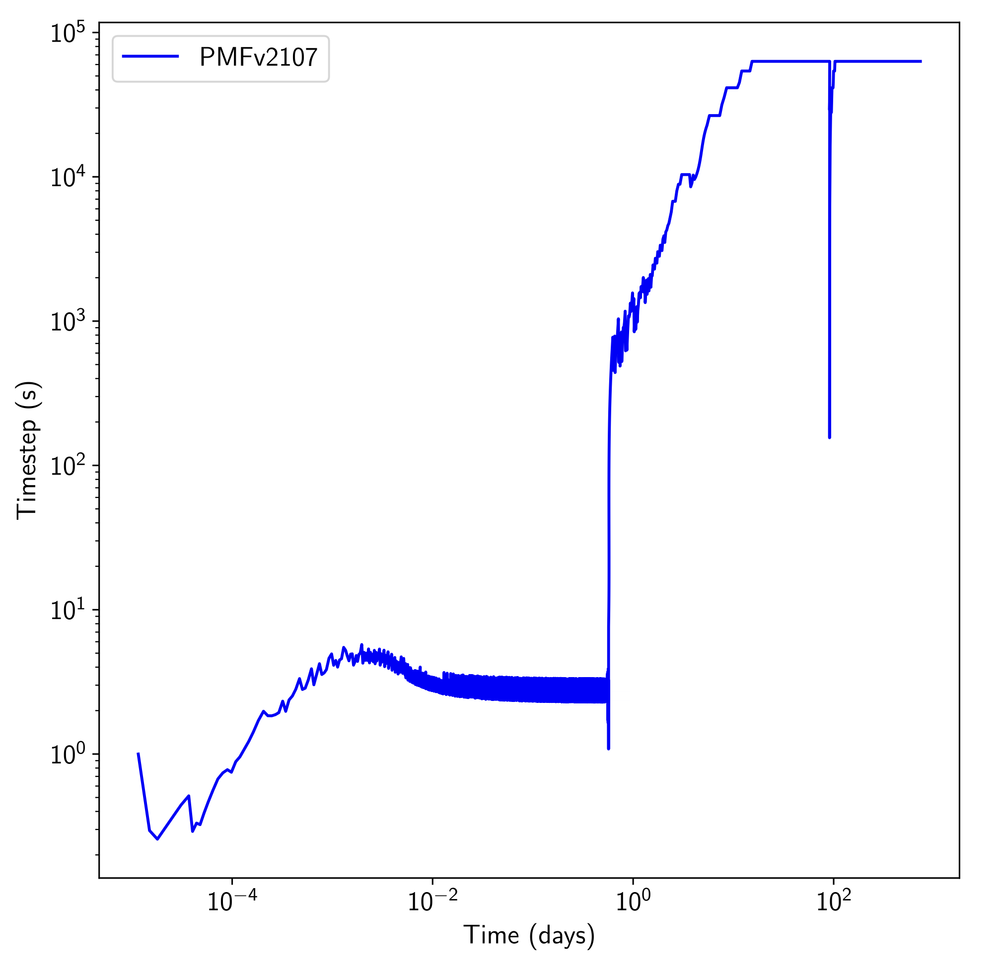

.. _groundwaterTransportFoam-tutorials:

groundwaterTransportFoam tutorials
==================================

The examples provided in the directory ``tutorials/groundwaterTransportFoam-tutorials/`` illustrate the usage of the **groundwaterTransportFoam** solver.

Validation Case: Water Injection with an Imposed Solute Concentration
---------------------------------------------------------------------

This case begins with a steady-state configuration (for further details, refer to the `Steady Validation Case - groundwaterFoam <file:///work/fabregues/milieux_poreux/porousMultiphaseFoam/doc/build/html/groundwaterFoam-tutorials.html>`_). Water is injected into the column (at :math:`z=24 \text{ m}`) with a fixed flow rate of :math:`Q_{in}=3.82 \times 10^{-5} \text{ kg}. \text{m}^{-3}` and an imposed solute concentration of :math:`C_{in} = 6.12 \times 10^{-11} \text{ kg}. \text{m}^{-3}` from :math:`t_{start} = 0` to :math:`t_{stop}=91` days. After injection stops, the simulation continues until :math:`t_{end} = 730` days.

This setup is critical for testing the solver's robustness as it involves:

- A sudden change in local water content

- The movement of a water front near saturation :math:`\displaystyle \left(h \approx -3.3 \times 10^{-3} \text{ and } \frac{\theta}{\theta_{max}} \approx 0.997\right)`, followed by a quasi-steady state

- A sharp transition upon the end of injection

- Capillary drainage over an extended period

The water and solute fluxes leaving the column are shown in the following images:

.. list-table::
   :widths: 50 50
   :header-rows: 0

   * - .. figure:: figures/groundwaterTransportFoam/solute_flux.png
        :width: 500px
        :alt: solute flux
     
     - .. figure:: figures/groundwaterTransportFoam/water_flux.png
        :width: 500px
        :alt: water flux

This case also highlights the effectiveness of time-step management based on truncation error. The figure below shows how the adaptive time-stepping method adjusts dynamically to changes in the physical system, optimizing step sizes to maintain accuracy while minimizing computational cost.

At the beginning of the simulation, during rapid water injection, small time steps (on the order of seconds) are employed to capture fast changes in water saturation near the injection point. As the water front propagates through the column, larger time steps are used when a quasi-steady state is reached. Once the injection stops at 91 days, the solver briefly reduces the step size to handle the abrupt change before resuming larger steps during the slow capillary drainage phase.

The figure below depicts the time-step evolution over the simulation's duration:

In addition to demonstrating the robustness of the **groundwaterTransportFoam** solver, this case underscores the challenges of using Picard's method in strongly nonlinear problems like this one. The Van Genuchten model, which is applied here for capillary functions, introduces significant nonlinearity, especially near saturation. While Picard’s method can converge slowly in such conditions, employing Newton’s method leads to quadratic convergence, reducing computation time from hours to minutes during method transitions.

This combined approach, leveraging the broad convergence range of Picard’s algorithm and the speed of Newton’s method, allows for efficient simulation even in challenging scenarios involving high flow rates in the vadose zone and complex capillary behavior.

