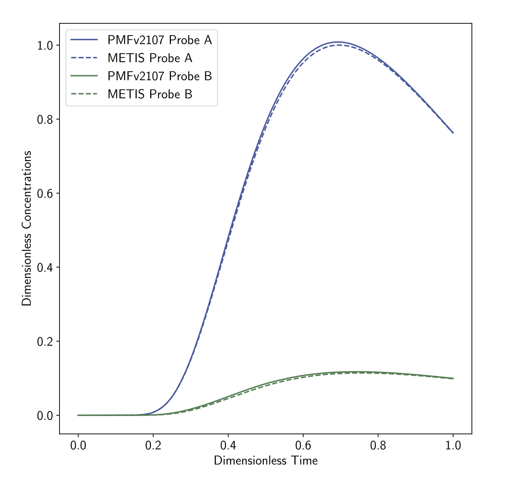

.. _porousScalarTransport2DFoam-tutorials:

porousScalarTransport2DFoam tutorials
=====================================

The examples provided in the directory ``tutorials/porousScalarTransport2DFoam-tutorials/`` illustrate the usage of the **porousScalarTransport2DFoam** solver.

Validation Case: Passive Tracer Transport in a 2D Watershed
-----------------------------------------------------------

Using the precomputed velocity field from the steady case, this simulation introduces a passive tracer with a source term :math:`Q_{tracer} = 5 \times 10^{-6} \text{ kg}. \text{m}^{-2}. \text{s}^{-1}` over a period of 40 years. The tracer transport is governed by dispersion and advection through the watershed.

Tracer concentration fields at different times are presented below:

.. list-table::
   :widths: 50 50
   :header-rows: 0

   * - .. figure:: figures/2D_solver/porousScalarTransport2DFoam/concentration_vizu_t02.png
        :width: 500px
        :alt: tracer concentration at t1

     - .. figure:: figures/2D_solver/porousScalarTransport2DFoam/concentration_vizu_tend.png
        :width: 500px
        :alt: tracer concentration at t2

The comparison between the tracer concentration at probes A and B confirms the correct behavior of the transport model:

