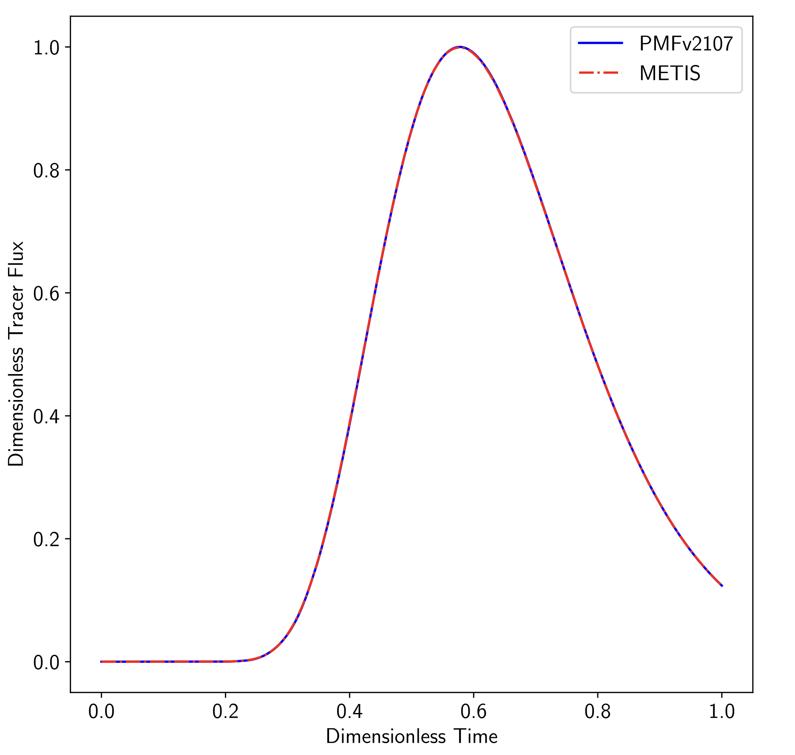

.. _porousScalarTransportFoam-tutorials:

porousScalarTransportFoam tutorials
===================================

The examples provided in the directory ``tutorials/porousScalarTransportFoam-tutorials/`` demonstrate the use of the **porousScalarTransportFoam** solver.

Validation Case: Passive Tracer Injection
-----------------------------------------

This validation case involves the injection of a passive tracer using pre-computed saturation and velocity fields from a steady-state simulation (for further details, refer to the `Steady Validation Case - groundwaterFoam <file:///work/fabregues/milieux_poreux/porousMultiphaseFoam/doc/build/html/groundwaterFoam-tutorials.html>`_). The setup is driven by a constant injection of a passive tracer at the top of the domain, with a flow rate of :math:`Q = 1.374 \times 10^{-8} \, \text{kg} \cdot \text{m}^{-2} \cdot \text{s}^{-1}` for a duration of 6622 seconds.

The simulation spans a physical time of approximately :math:`1.262 \times 10^9` seconds, which is close to 40 years.

The figure below shows the solute flux exiting the column, comparing results from the **porousScalarTransportFoam** solver and the **METIS** solver (our reference solution):

The agreement between both solvers validates the correct implementation of several important factors influencing solute transport, such as heterogeneous saturation, dispersion, decay, and retardation effects.

